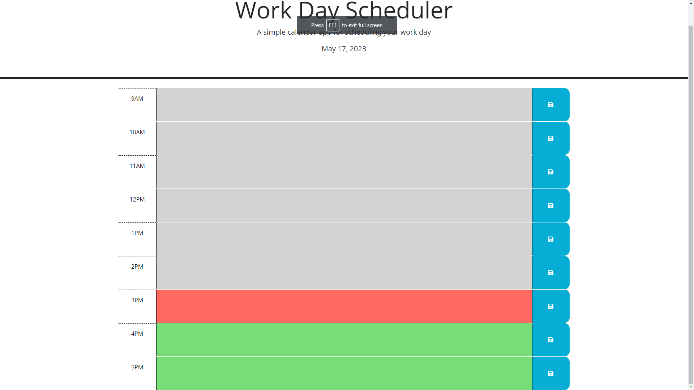
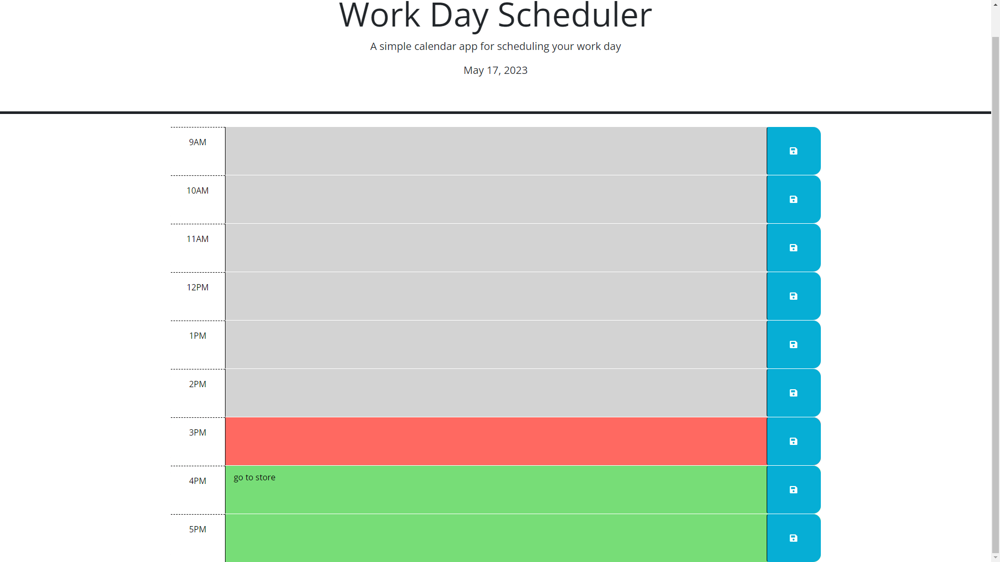

# Work-Day-Scheduler

This is a simple web app that uses jquery, dayjs, and local storage to create a daily planner that you can add events to. Dayjs is implemented to show the current day and time and is displayed by the colors on the hour blocks. local storage saves the events and displays them through refreshing the page.

## Table of Contents

- [User Story](#user-story)
- [Installation](#installation)
- [DeploymentURL](#deploymentURL)
- [Usage](#usage)
- [Credits](#credits)

## User Story

AS AN employee with a busy schedule

I WANT to add important events to a daily planner

SO THAT I can manage my time effectively

## Installation 

go to deployed URL

## Deployment URL 

## Usage

## Credits
-technologies used:

DayJS